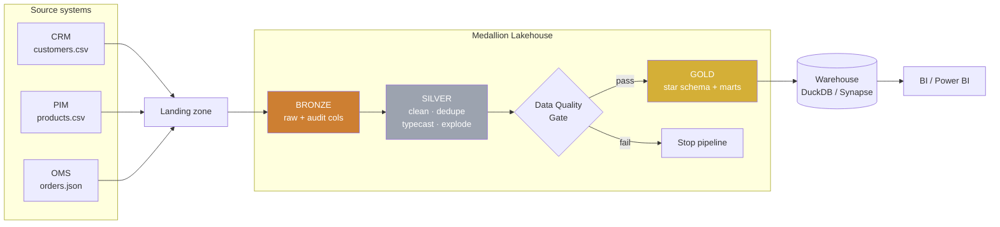
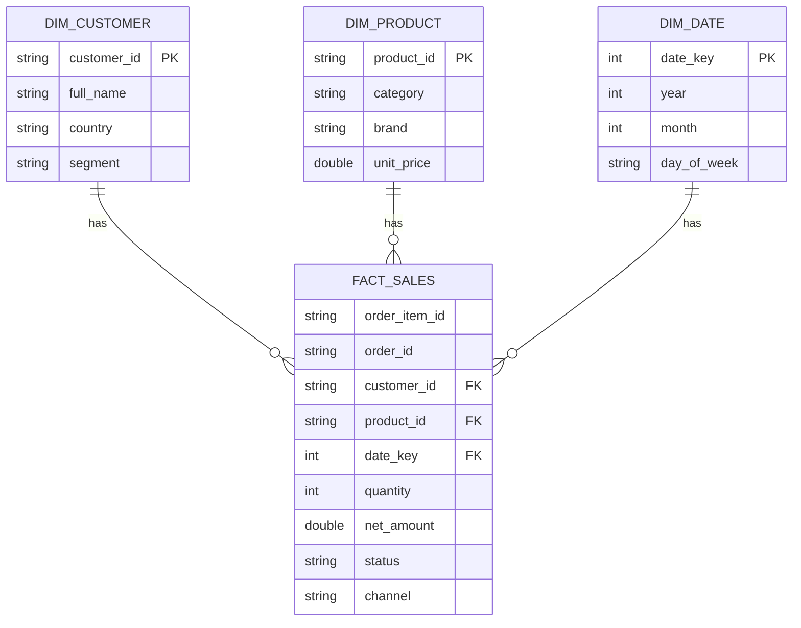

# Architecture

End-to-end flow of the e-commerce medallion pipeline. GitHub renders the
Mermaid diagram below automatically.

## Star schema

## Local ↔ Azure mapping

| Stage | Local | Azure |
|---|---|---|
| Orchestration | `ecommerce_pipeline.pipeline` | Azure Data Factory |
| Compute | Spark `local[*]` | Azure Databricks |
| Storage | `./data/lakehouse` (Parquet) | ADLS Gen2 (Delta) |
| Serving | DuckDB | Synapse / Databricks SQL |
